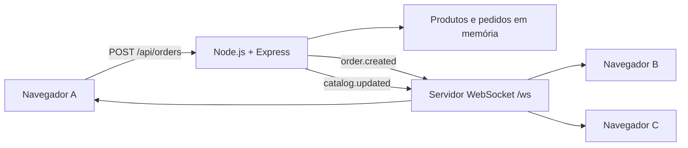

# Esquema WebSocket

O WebSocket público usa o mesmo servidor HTTP da aplicação.

- desenvolvimento: `ws://localhost:3000/ws`
- Render: `wss://SEU-SERVICO.onrender.com/ws`



## Envelope de mensagens

Todas as mensagens enviadas pelo servidor usam o mesmo envelope:

```json
{
  "type": "catalog.updated",
  "data": {},
  "sentAt": "2026-08-15T12:00:00.000Z"
}
```

## Eventos enviados pelo servidor

### `connection.ready`

Enviado somente ao cliente que acabou de se conectar. Fornece o estado inicial necessário para renderizar a tela.

```json
{
  "type": "connection.ready",
  "data": {
    "clientId": "b27c5b1d-8ee8-4d9b-b61e-e88d31080d48",
    "products": [
      {
        "id": "cafe",
        "name": "Café especial",
        "description": "Pacote de 500 g, torra média",
        "price": 3290,
        "stock": 12,
        "emoji": "☕"
      }
    ],
    "recentOrders": []
  },
  "sentAt": "2026-08-15T12:00:00.000Z"
}
```

Os valores monetários são inteiros em centavos.

### `order.created`

Transmitido para todos os clientes quando a API aceita uma nova venda.

```json
{
  "type": "order.created",
  "data": {
    "order": {
      "id": "adbd9210-24c0-4f76-9153-a111968e95ce",
      "customer": "Maria Silva",
      "items": [
        {
          "productId": "cafe",
          "name": "Café especial",
          "quantity": 2,
          "unitPrice": 3290,
          "subtotal": 6580
        }
      ],
      "total": 6580,
      "createdAt": "2026-08-15T12:00:00.000Z"
    }
  },
  "sentAt": "2026-08-15T12:00:00.000Z"
}
```

### `catalog.updated`

Transmitido depois de uma venda. Contém uma fotografia completa do catálogo para que todos os clientes reconciliem o estoque.

```json
{
  "type": "catalog.updated",
  "data": {
    "products": []
  },
  "sentAt": "2026-08-15T12:00:00.000Z"
}
```

### `server.shutdown`

Enviado antes de um encerramento normal, como durante um deploy no Render. O cliente deve se reconectar.

```json
{
  "type": "server.shutdown",
  "data": { "reconnect": true },
  "sentAt": "2026-08-15T12:00:00.000Z"
}
```

### `error`

Informa que o servidor não conseguiu interpretar uma mensagem recebida.

```json
{
  "type": "error",
  "data": { "message": "Mensagem WebSocket inválida." },
  "sentAt": "2026-08-15T12:00:00.000Z"
}
```

## Eventos aceitos do cliente

O fluxo de venda usa HTTP para permitir respostas e códigos de erro claros. O único evento de aplicação aceito atualmente no WebSocket é um ping opcional:

```json
{ "type": "ping" }
```

Resposta:

```json
{
  "type": "pong",
  "data": {},
  "sentAt": "2026-08-15T12:00:00.000Z"
}
```

O servidor também envia frames WebSocket de `ping` a cada 30 segundos. A biblioteca do navegador responde com `pong` automaticamente.

## Reconexão

O frontend tenta se reconectar com espera exponencial de 1, 2, 4, 8 e no máximo 15 segundos. Ao receber novamente `connection.ready`, ele substitui o catálogo local pelo estado atual do servidor.

## Escala horizontal

Em uma única instância, `broadcast()` alcança todos os clientes conectados. Com duas ou mais instâncias no Render, cada processo conhece somente os próprios clientes. Nesse cenário, publique os eventos em Redis/Render Key Value e faça cada instância retransmiti-los para suas conexões WebSocket.
